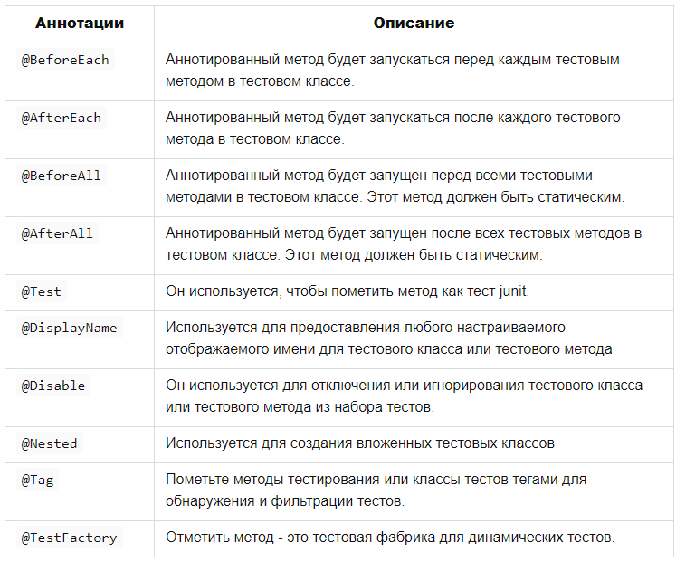
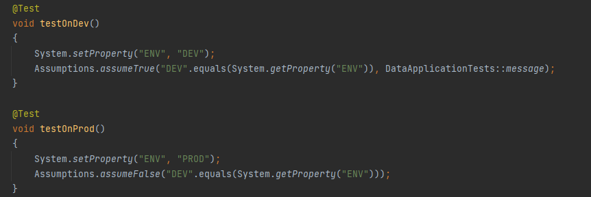
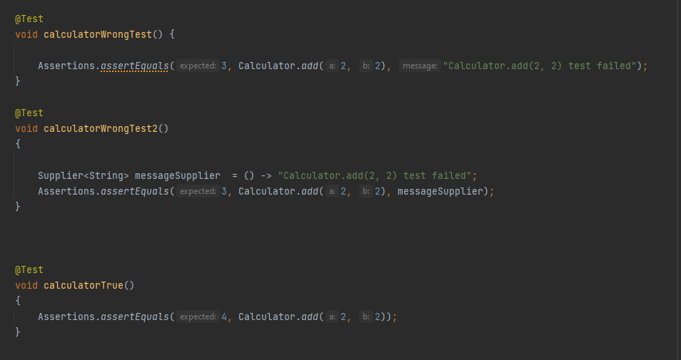
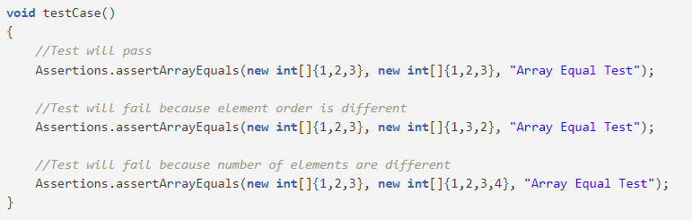
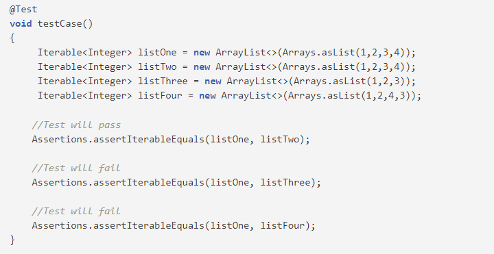
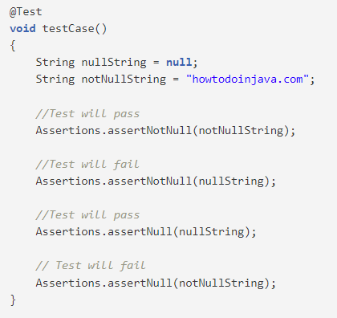
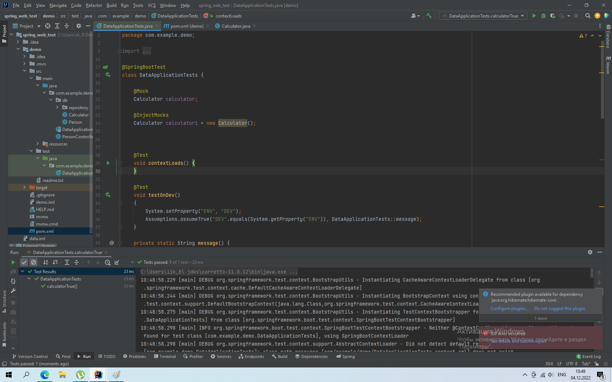

# Тестрование

- Модульное тестирование (unit testing) — тесты, задача которых проверить каждый модуль системы по отдельности. Желательно, чтобы это были минимально делимые кусочки системы, например, модули.

- Системное тестирование (system testing) — тест высокого уровня для проверки работы большего куска приложения или системы в целом.

- Регрессионное тестирование (regression testing) — тестирование, которое используется для проверки того, не влияют ли новые фичи или исправленные баги на существующий функционал приложения и не появляются ли старые баги.

- Функциональное тестирование (functional testing) — проверка соответствия части приложения требованиям, заявленным в спецификациях, юзерсторях и т. д.

Виды функционального тестирования:

тест «белого ящика» (white box) на соответствие части приложения требованиям со знанием внутренней реализации системы;
тест «черного ящика» (black box) на соответствие части приложения требованиям без знания внутренней реализации системы.

- Тестирование производительности (performance testing) — вид тестов, которые пишутся для определения скорости отработки системы или ее части под определённой нагрузкой.

- Нагрузочное тестирование (load testing) — тесты, предназначенные для проверки устойчивости системы при стандартных нагрузках и для нахождения максимально возможного пика, при котором приложение работает корректно.

- Стресс-тестирование (stress testing) — вид тестирования, предназначенный для проверки работоспособности приложения при нестандартных нагрузках и для определения максимально возможного пика, при котором система не упадёт.

- Тестирование безопасности (security testing) — тесты, используемые для проверки безопасности системы (от атак хакеров, вирусов, несанкционированного доступа к конфиденциальным данным и прочих радостей жизни).

- Тестирование локализации (localization testing) — это тесты локализации для приложения.

- Юзабилити тестирование (usability testing) — вид тестирования, направленный на проверку  удобства использования, понятности, привлекательности и обучаемости для пользователей.

#JUNIT

JUnit – это Java фреймворк для тестирования, т. е. тестирования отдельных участков кода, например, методов или классов. Опыт, полученный при работе с JUnit, важен в разработке концепций тестирования программного обеспечения.
JUnit позволяет в любой момент быстро убедиться в работоспособности кода. Если программа не является совсем простой и включает множество классов и методов, то для её проверки может потребоваться значительное время. Естественно, что данный процесс лучше автоматизировать. Использование JUnit позволяет проверить код программы без значительных усилий и не занимает много времени.

**Виды тестирования и место JUnit тестирования в классификации**

Тестирование программного обеспечение можно разделить на два вида:

- тестирование черного ящика;
- тестирование белого ящика.

**Аннотации JUnit 5**

**Классы тестирования:**

1) Класс Assumptions (предположения) предоставляет staticметоды для поддержки выполнения условного теста на основе предположений. Неуспешное предположение приводит к прерыванию теста.

2) Assertions (утверждения) позволяют сравнить ожидаемый результат с фактическим результатом теста.

Самый популярный класс тестировния

- assertEquals()и assertNotEquals() -  утверждает, чтоожидаемое значение и фактическое значение равны/не равны

- assertArrayEquals() - метод assertArrayEquals() утверждает, что ожидаемый и фактический массивы равны.

- assertIterableEquals() -  утверждает, что ожидаемые и фактические итерации глубоко равны. Глубокое равенство означает, что количество и порядок элементов в коллекции должны быть одинаковыми, а итерированные элементы должны быть равными.

- assertNotNull() и assertNull() - утверждает, что actual НЕ является null. Точно так же метод утверждает, что фактическое есть.

#Mokito

Фреймворк Mockito предоставляет ряд возможностей для создания заглушек вместо реальных классов или интерфейсов при написании JUnit тестов.
Наибольшее распространение получили следующие возможности Mockito :

- создание заглушек для классов и интерфейсов;
- проверка вызыва метода и значений передаваемых методу параметров;
- использование концепции «частичной заглушки», при которой заглушка создается на класс с определением поведения, требуемое для некоторых методов класса;
- подключение к реальному классу «шпиона» spy для контроля вызова методов.

Mockito позволяет вызвать исключение при определенных условиях.
Mockito позволяет подключать к реальным объектам «шпиона» spy, контролировать возвращаемые методами значения и отслеживать количество вызовов методов.
